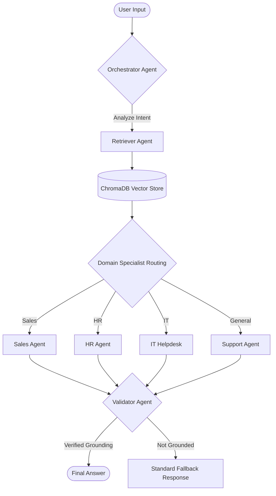
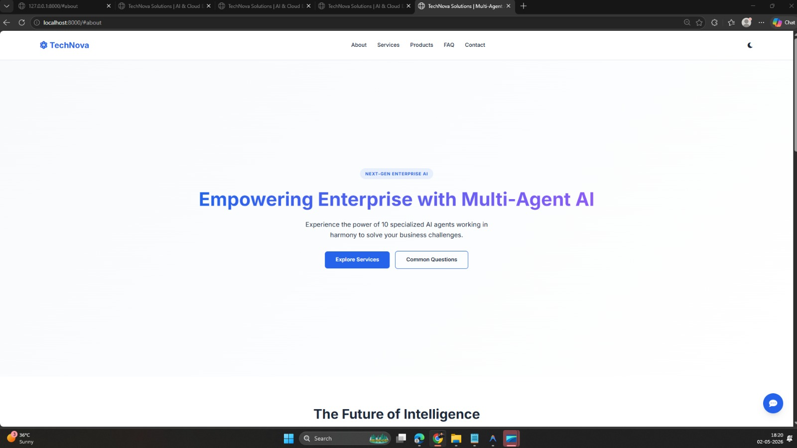

# 🌌 TechNova Solutions – Enterprise Multi-Agent RAG FAQ Chatbot

[](https://www.python.org/downloads/)
[](https://fastapi.tiangolo.com/)
[](https://github.com/langchain-ai/langgraph)
[](https://groq.com/)
[](https://www.trychroma.com/)

## 📝 Project Overview

**TechNova Solutions** is a state-of-the-art enterprise AI platform designed to automate customer support, HR queries, IT troubleshooting, and sales intelligence. Built with a **Multi-Agent Orchestration** architecture and a deep **RAG (Retrieval-Augmented Generation)** engine, the assistant provides highly accurate, context-aware responses grounded in 60+ internal enterprise documents.

---

## ✨ Features

- **🧠 Specialized Multi-Agent System**: 10 intelligent agents working in sync to handle Sales, HR, IT, and more.
- **📚 Advanced RAG Pipeline**: Semantic search across 850+ indexed entries using ChromaDB.
- **🛡️ Hallucination Guardrails**: Dedicated Validator node ensures zero misinformation.
- **📊 Real-time Performance Analytics**: Internal dashboard to monitor agent distribution and latency.
- **🎨 Premium Enterprise UI**: Dark-themed responsive interface with real-time "Thinking" animations.

---

## 🏗️ Multi-Agent Architecture & RAG Workflow

The application uses **LangGraph** to manage the state and transitions between agents. Below is the technical breakdown of how a user query is processed end-to-end.



---

## 🚀 End-to-End Setup & Deployment Guide

Follow these steps to get the enterprise platform running from scratch on your local machine.

### **Step 1: Clone & Environment Setup**
First, clone the repository and set up a clean Python environment.
```bash
git clone https://github.com/yourusername/technova-ai-assistant.git
cd technova-ai-assistant
python -m venv venv
source venv/bin/activate  # Windows: venv\Scripts\activate
pip install -r requirements.txt
```

### **Step 2: Configuration**
Create a `.env` file in the root directory and add your Groq API Key.
```env
GROQ_API_KEY=your_groq_api_key_here
```

### **Step 3: Knowledge Base Ingestion**
This step processes the 60+ technical documents in the `docs/` folder, creates embeddings, and stores them in the ChromaDB vector database.
```bash
python backend/ingest.py
```

### **Step 4: Launch the Multi-Agent Platform**
Start the FastAPI server. This will launch the backend orchestration graph and serve the modern frontend.
```bash
python backend/main.py
```

### **Step 5: Access & Interaction**
- **Main Chat Interface**: [http://localhost:8000](http://localhost:8000)
- **Analytics Dashboard**: [http://localhost:8000/analytics](http://localhost:8000/analytics)
- **API Documentation**: [http://localhost:8000/docs](http://localhost:8000/docs)

---

## 📸 Project Walkthrough (Step-by-Step)

### 1. Landing Page Initialization
The entry point of the application, featuring the TechNova Solutions brand and service overview.


### 2. Specialized Service Exploration
Users can scroll through the services and products to understand the company's domain before interacting.
.jpeg)

### 3. Activating the AI Assistant
Clicking the floating chat bubble launches the multi-agent widget.
.jpeg)

### 4. Intent Detection & Agent Orchestration
When a user asks a question, the Orchestrator identifies the department and routes the query.
.jpeg)

### 5. Grounded RAG Response Delivery
The final response is delivered only after the Validator confirms the data is present in our enterprise knowledge base.
.jpeg)

### 6. Support & FAQ Engagement
Integrated FAQ and Contact sections ensure users have multiple paths for resolution.
.jpeg)

---

## 📂 Project Structure

```text
Multi-Agent-AI-FAQ-Chatbot/
├── backend/                # Core AI Logic
│   ├── agents.py           # 10 specialized agent nodes
│   ├── graph.py            # LangGraph workflow orchestration
│   ├── main.py             # FastAPI serving & API layer
│   ├── ingest.py           # Vector database management
│   └── analytics.py        # Real-time usage tracking
├── docs/                   # 60+ Enterprise documents
├── frontend/               # Modern Vanilla JS App
├── photo/                  # Walkthrough Screenshots
├── requirements.txt        # Backend dependencies
└── .env                    # Secure configuration
```

---

## 🔮 Future Roadmap

- **Multi-Modal IT Support**: Analyze screenshots for hardware troubleshooting.
- **Enterprise SSO Integration**: For secure HR and Management access.
- **Predictive Analytics**: Analyzing query trends to suggest document updates.

---

## ⚖️ License
Distributed under the **MIT License**.

<p align="center">
  Built with ❤️ for the TechNova Solutions Engineering Team
</p>

---

## 👨‍💻 Developed By

**Bittu Sharma**  
*AI and MLOps Engineer*

[](https://www.linkedin.com/in/your-profile)
[](https://github.com/bittush8789)

