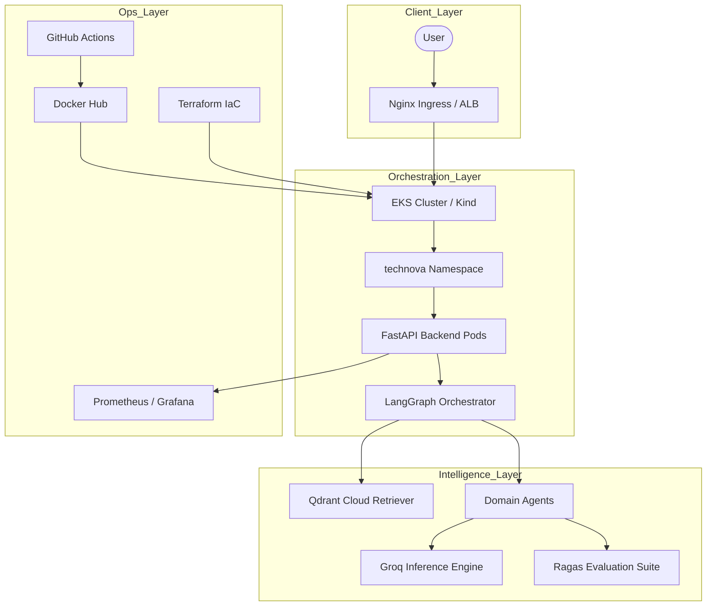

# 🌌 TechNova Solutions – Enterprise Multi-Agent LLMOps Platform

[](https://github.com/bittush8789/llmops-multi-agent-rag-chatbot)
[](https://kubernetes.io/)
[](https://www.terraform.io/)
[](https://opensource.org/licenses/Apache-2.0)

## 🏗️ 1. Professional Architecture
The platform utilizes a decoupled, cloud-native architecture optimized for enterprise scale and multi-agent intelligence.



---

## 🚀 2. End-to-End Execution Flow

Follow these steps to deploy the complete platform from raw data to a live production cluster.

### **Step 1: Knowledge Ingestion (Data Pipeline)**
Transform 60+ enterprise documents into semantic vectors and store them in the cloud.
```bash
# Set credentials in .env first
python -m backend.ingest
```

### **Step 2: AI Quality Evaluation (LLMOps CI)**
Quantify the accuracy and faithfulness of your RAG system before deployment.
```bash
# Runs Ragas metrics against ground-truth dataset
python -m backend.evaluator
```

### **Step 3: Infrastructure Provisioning (IaC)**
Automatically set up the AWS EKS cluster and VPC using Terraform.
```bash
cd infra
terraform init
terraform apply --auto-approve
```

### **Step 4: Local Testing (Kubernetes in Docker)**
Verify the deployment locally using a `Kind` cluster before pushing to the cloud.
```bash
kind create cluster --name technova-dev
kubectl apply -f k8s/rbac.yaml
kubectl apply -f k8s/deployment.yaml
kubectl apply -f k8s/service.yaml
```

### **Step 5: Production Rollout (AWS EKS)**
Deploy the modular manifests to the live enterprise cluster.
```bash
aws eks update-kubeconfig --region us-east-2 --name technova-eks-cluster
kubectl apply -f k8s/
kubectl rollout status deployment/technova-backend -n technova
```

### **Step 6: Real-time Monitoring**
Access metrics and traces to ensure system health and agent performance.
- **Metrics**: `http://localhost:3000` (Grafana)
- **API Health**: `http://<LB_IP>/health`

---

## 🛠️ 3. Comprehensive Tool Guide

| Tool | Purpose | Primary Command |
| :--- | :--- | :--- |
| **Docker** | Containerization | `docker build -t technova-app .` |
| **Kind** | Local K8s | `kind create cluster` |
| **Terraform** | IaC | `terraform apply` |
| **Kubectl** | Cluster Management | `kubectl get pods -n technova` |
| **Ragas** | AI Evaluation | `python -m backend.evaluator` |
| **FastAPI** | Application Core | `uvicorn backend.main:app` |

---

## 🛡️ 4. Security & Compliance
- **Namespace Isolation**: All production resources are isolated in the `technova` namespace.
- **RBAC**: Fine-grained permissions defined in `rbac.yaml` for pod-to-api communication.
- **Secret Management**: API keys are injected via K8s Secrets, never hardcoded.
- **Output Guardrails**: Integrated validation node to prevent hallucinations.

---

## 👨‍💻 Developed By
**Bittu Sharma**  
*AI and MLOps Engineer*

[](https://www.linkedin.com/in/your-profile)
[](https://github.com/bittush8789)

---
⚖️ **Apache License 2.0**
