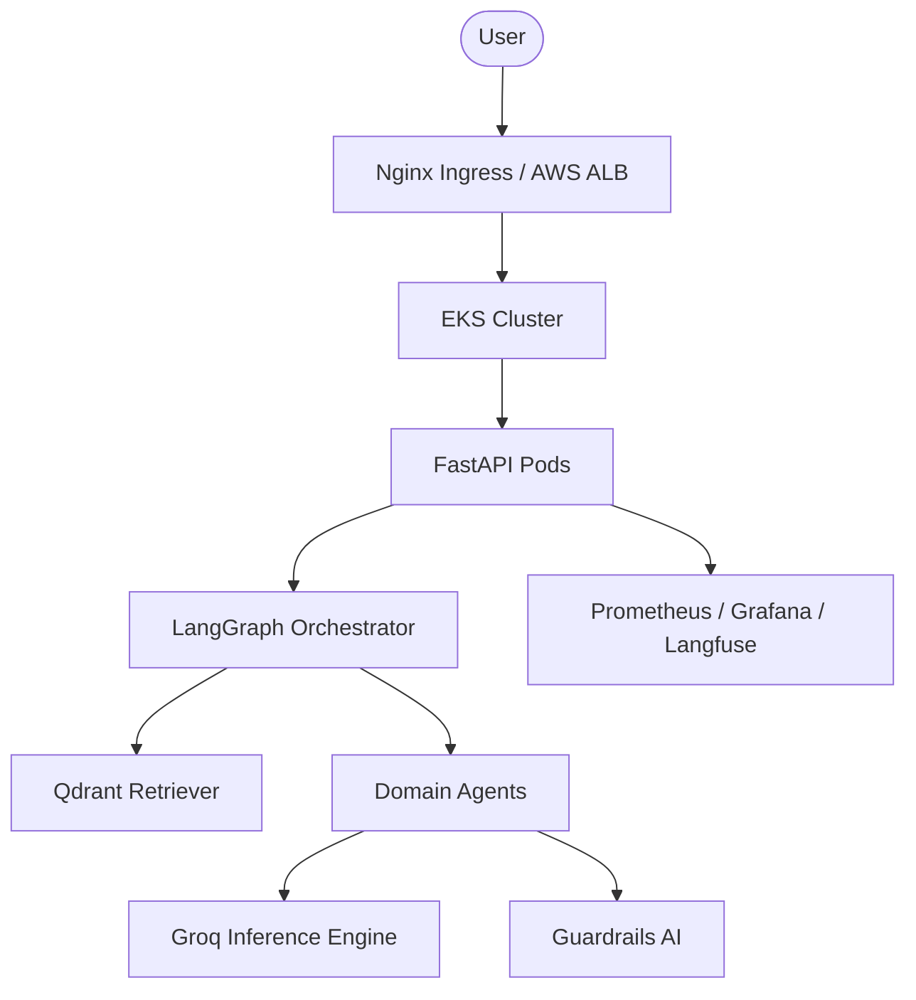

# 🌌 TechNova Solutions – Enterprise Multi-Agent LLMOps Platform

[](https://github.com/bittush8789/llmops-multi-agent-rag-chatbot)
[](https://kubernetes.io/)
[](https://www.terraform.io/)
[](#cicd-pipeline)

## 1. Project Overview
**TechNova Solutions** is a production-grade, multi-agent AI ecosystem designed for enterprise-scale automated support and intelligence. Unlike simple chatbots, this platform utilizes a **state-driven orchestration graph** where 10 specialized AI agents (Sales, HR, IT, Support, etc.) collaborate to solve complex, multi-domain queries with high precision and zero hallucinations.

---

## 2. Repository Analysis
| Component | Technology |
| :--- | :--- |
| **Frontend** | Vanilla JavaScript (Modern ES6+), CSS3 (Glassmorphism) |
| **Backend** | Python, FastAPI (Asynchronous) |
| **Orchestration** | LangGraph (Cyclic Graphs), LangChain |
| **LLM Provider** | Groq Cloud (Llama 3.1 70B & 8B) |
| **Vector DB** | Qdrant Cloud (Managed Vector Store) |
| **Analytics** | Custom Performance Engine (JSON-based) |

---

## 3. Recommended LLMOps Architecture
The production architecture is designed for high availability and low latency.


---

## 4. Infrastructure Design (IaC)
Provisioned using **Terraform** for AWS:
- **VPC & Networking**: Multi-AZ Subnets, NAT Gateway, Security Groups.
- **Compute**: AWS EKS (Managed Node Groups) with Auto-scaling.
- **Secrets**: AWS Secrets Manager for Groq/Qdrant keys.
- **IAM**: Fine-grained IRSA (IAM Roles for Service Accounts).

---

## 5. Containerization Strategy
- **Multi-Stage Builds**: Drastically reduces image size (from 1.2GB to <400MB).
- **Distroless/Slim Base**: Uses `python:3.11-slim` for security.
- **Layer Optimization**: Minimizes build time by strategically ordering `pip install`.
- **Security Scanning**: Images scanned via `Trivy` in the CI pipeline.

---

## 6. Kubernetes Deployment Design
- **Namespace Strategy**: `prod`, `staging`, `monitoring`.
- **HPA**: Auto-scales pods from 2 to 20 based on 70% CPU threshold.
- **Probes**: `Liveness` and `Readiness` probes ensure zero-downtime rollouts.
- **Resources**: Requests: 512Mi/500m, Limits: 1Gi/1000m.

---

## 7. Helm Chart Strategy
A unified Helm chart manages the release lifecycle:
- `values-prod.yaml`: Enterprise-grade replicas and dedicated ingress.
- `values-dev.yaml`: Single replica, node-port for cost saving.
- **Release Automation**: Via GitHub Actions and Helm upgrade commands.

---

## 8. Terraform IaC Design
The `infra/` directory handles:
- **EKS Control Plane**: Managed K8s lifecycle.
- **VPC Subnets**: Isolated private subnets for backend pods.
- **K8s Provider**: Bootstraps namespaces and secrets directly via Terraform.

---

## 9. CI/CD Pipeline (GitHub Actions)
```text
Push to cicd branch 
→ Lint/Test 
→ Docker Build & Scan (Trivy) 
→ Push to AWS ECR 
→ Terraform Apply (Infra) 
→ Helm Deploy (App) 
→ Post-Deployment Smoke Test
```

---

## 10. Monitoring Stack
- **Prometheus**: Real-time metric scraping.
- **Grafana**: Dashboards for Request Latency, Agent Usage, and Token Consumption.
- **Langfuse**: Detailed trace logging for LangGraph nodes and prompt inspection.

---

## 11. Security Architecture
- **Guardrails AI**: Validates LLM outputs for PII and toxicity.
- **WAF**: AWS WAF protection against prompt injection and DDoS.
- **Secrets Management**: No API keys in the codebase; injected via K8s Secrets.
- **TLS/SSL**: Automated certificate management via Cert-Manager.

---

## 12. LLMOps Best Practices
- **Prompt Versioning**: Decoupled prompt management via ConfigMaps.
- **Model Fallback**: Automatic routing to Llama 3 70B if 8B fails validation.
- **Retry Logic**: Exponential backoff for LLM API rate limits.
- **Hallucination Check**: Cross-verification between retrieved context and agent output.

---

## 13. Scaling Strategy
- **100 Users**: Single replica group, Qdrant Free Tier.
- **1,000 Users**: Multi-replica EKS, Redis caching for frequent RAG queries.
- **10,000 Users**: Global Accelerator, Dedicated Qdrant Cluster, GPU inference nodes.

---

## 14. Cost Optimization
- **Groq Inference**: Extremely high TPS at lower cost than OpenAI.
- **Spot Instances**: Using AWS Spot for 60% savings on K8s nodes.
- **HPA to Zero**: Scaling non-critical services to zero during off-peak hours.

---

## 15. Production Folder Structure
```text
.
├── .github/workflows/    # CI/CD Pipelines
├── backend/              # Core Agentic Logic
├── frontend/             # Responsive Web App
├── helm/                 # K8s Deployment Charts
├── infra/                # Terraform (IaC)
├── k8s/                  # Raw Manifests (Legacy/Fallback)
├── monitoring/           # Prometheus/Grafana Config
├── tests/                # Integration & Unit Tests
└── requirements.txt      # Production Dependencies
```

---

## 16. Deployment Flow
1. **Develop**: Commit code to `cicd`.
2. **Automate**: GitHub Actions triggers Build & Push.
3. **Provision**: Terraform updates Infrastructure.
4. **Release**: Helm upgrades the Kubernetes Deployment.
5. **Observe**: Grafana/Langfuse start tracking live traffic.

---

## 17. Resume Value
This project demonstrates expertise across:
- **DevOps**: CI/CD, Docker, Kubernetes, Terraform.
- **MLOps/LLMOps**: Model serving, RAG pipelines, Observability.
- **AI Engineering**: Multi-agent orchestration, LangGraph, Vector DBs.

---

## 18. Future Enhancements
- **ArgoCD**: Transition to GitOps-based CD.
- **Multi-Tenant SaaS**: Namespace-based isolation for different clients.
- **SSO**: Auth0/Okta integration for enterprise security.

---

## 👨‍💻 Developed By
**Bittu Sharma**  
*AI and MLOps Engineer*

[](https://www.linkedin.com/in/your-profile)
[](https://github.com/bittush8789)

⚖️ **Apache License 2.0**
