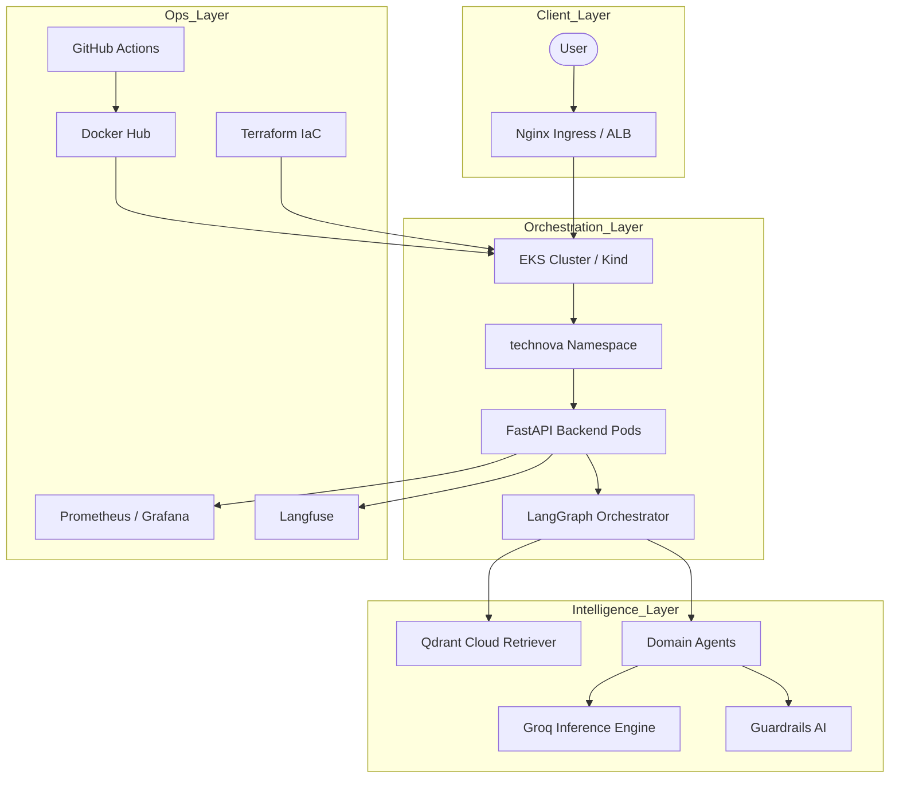

# 🌌 TechNova Solutions – Enterprise Multi-Agent LLMOps Platform

[](https://github.com/bittush8789/llmops-multi-agent-rag-chatbot)
[](https://kubernetes.io/)
[](https://www.terraform.io/)
[](https://opensource.org/licenses/Apache-2.0)

## 🏗️ 1. Project Architecture
The platform follows a highly decoupled, cloud-native architecture designed for 99.9% availability and rapid multi-agent orchestration.



---

## 🛠️ 2. Comprehensive Tool Command Guide

### 🐳 **Docker (Containerization)**
Standardized builds for cross-environment consistency.
```bash
# Build the production-grade multi-stage image
docker build -t bittush8789/llmops-chatbot:latest .

# Run the container locally with environment variables
docker run -p 8000:8000 --env-file .env bittush8789/llmops-chatbot:latest

# Push to Docker Hub
docker push bittush8789/llmops-chatbot:latest
```

### ☸️ **Kubernetes - Local (Kind)**
For rapid development and local testing of K8s manifests.
```bash
# Create the local cluster
kind create cluster --name technova-dev

# Apply all manifests in order (Namespace -> RBAC -> Deployment -> Service -> Ingress)
kubectl apply -f k8s/rbac.yaml
kubectl apply -f k8s/deployment.yaml
kubectl apply -f k8s/service.yaml
kubectl apply -f k8s/ingress.yaml

# Check pod status in the technova namespace
kubectl get pods -n technova
```

### ☸️ **Kubernetes - Production (AWS EKS)**
Scalable production environment.
```bash
# Update local kubeconfig for EKS
aws eks update-kubeconfig --region us-east-2 --name technova-eks-cluster

# Deploy production manifests
kubectl apply -f k8s/

# Monitor horizontal pod scaling
kubectl get hpa -n technova
```

### 🌍 **Terraform (Infrastructure as Code)**
Automated cloud provisioning.
```bash
cd infra
terraform init    # Initialize providers
terraform plan    # Preview infrastructure changes
terraform apply   # Execute provisioning
```

### 🧠 **Data Pipeline (Ingestion)**
Populating the Qdrant Cloud Vector Store.
```bash
# Install local dependencies
pip install -r requirements.txt

# Run the ingestion script
python -m backend.ingest
```

---

## 🔄 3. CI/CD Lifecycle
Our GitHub Actions pipeline automates the entire "Code to Cloud" journey:
1. **Validation**: Static analysis and linting (flake8).
2. **Build**: Docker build with multi-stage optimization.
3. **Scan**: Vulnerability scanning of the image.
4. **Deploy**: Terraform updates infrastructure, and Kubectl rolls out the latest image SHA to the `technova` namespace.

---

## 🛡️ 4. Security & Monitoring
- **RBAC**: Strict Role-Based Access Control implemented via `rbac.yaml`.
- **Namespace Isolation**: All resources live in the `technova` namespace.
- **Observability**: Prometheus scrapes metrics on `/metrics`, visualized in Grafana.
- **Traceability**: Langfuse integration for step-by-step agent trace analysis.

---

## 📂 5. Enterprise Folder Structure
```text
.
├── .github/workflows/    # CI/CD (GitHub Actions)
├── backend/              # Multi-Agent Logic & API
├── docs/                 # 60+ Enterprise Knowledge Files
├── frontend/             # Responsive Web Interface
├── infra/                # Terraform (IaC)
├── k8s/                  # Modular K8s Manifests
├── Dockerfile            # Multi-stage Production Build
├── requirements.txt      # Dependency Management
└── README.md             # Master Documentation
```

---

## 👨‍💻 Developed By
**Bittu Sharma**  
*AI and MLOps Engineer*

[](https://www.linkedin.com/in/your-profile)
[](https://github.com/bittush8789)

⚖️ **Apache License 2.0**
